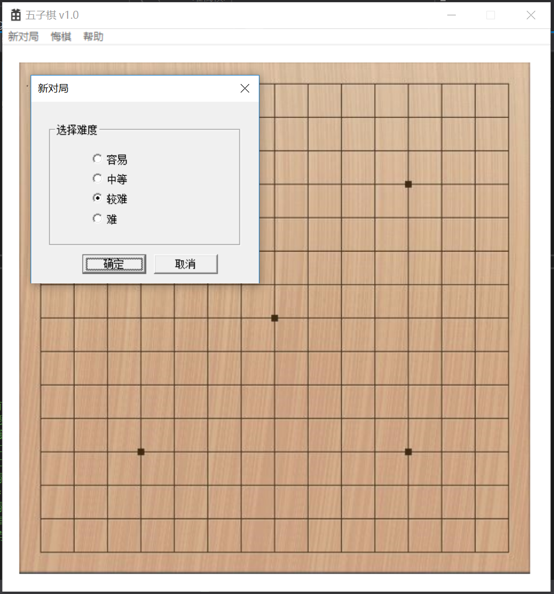
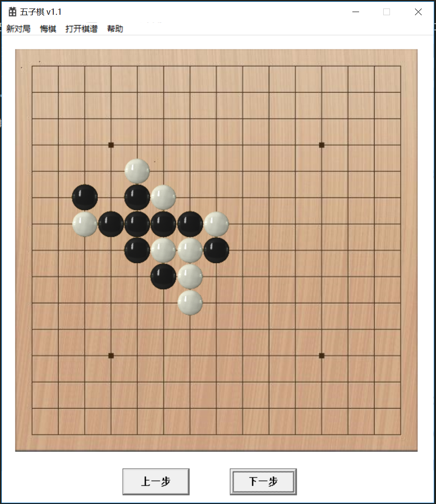

### 可执行程序下载
点击以下链接下载相应版本的可执行程序：
* [v0.1](https://kimlongli.github.io/files/fivechess.zip) 初始版本
* [v1.0](https://kimlongli.github.io/files/fivechess1.0.zip) 使用C++重写界面
* [v1.1](https://kimlongli.github.io/files/fivechess1.1.zip) 加入保存和查看棋谱的功能
* [v1.2](https://kimlongli.github.io/files/fivechess1.2.zip) 加入AC算法和修复模式匹配的bug
* [v1.3](https://kimlongli.github.io/files/fivechess1.3.zip) 加入qq五子棋辅助彩蛋

### 原理
本程序所用到的算法以及优化技术有：
* 博弈树
* alpha-beta剪枝
* 加入启发式搜索
* 每层选取最有可能出现的10种可能
* 增量式的评分算法
* 置换表
* AC算法（用于模式匹配）

具体可参见[这篇技术博客](https://kimlongli.github.io/2016/12/14/%E5%A6%82%E4%BD%95%E8%AE%BE%E8%AE%A1%E4%B8%80%E4%B8%AA%E8%BF%98%E5%8F%AF%E4%BB%A5%E7%9A%84%E4%BA%94%E5%AD%90%E6%A3%8BAI/)。

### 对外接口
五子棋AI的实现在ChessEngine.h和ChessEngine.cpp里，其余为界面实现，若想把此五子棋AI整合到自己项目中，可把ChessEngine.h和ChessEngine.cpp拷贝出来单独使用(这两个文件依赖于ACSearcher.h、PossiblePositionManager.h以及相应的cpp文件)。接口详情如下：
* void beforeStart();
五子棋AI的一些初始化操作，可在程序开始运行时调用。
* int isSomeOneWin(); 
判断此时是否有谁（电脑或者人）赢了，电脑赢了返回1， 人赢了返回0， 否则返回-1。
* string takeBack(); 
悔棋，返回参数为一个15\*15长度的字符串，代表当前棋盘布局，'0'代表无棋子，'1'代表一种棋子，'2'代表另一种棋子。
* string reset(int role); 
清除之前的记录，重新开局。role为0时为人先走，为1时为电脑先走。返回值为新的棋盘布局。
* void setLevel(int level);
重新设置搜索层数。
* Position getLastPosition();
取得刚才电脑下的那一步棋子的位置。
* string nextStep(int x, int y);
人类在位置为(x, y)的地方下棋，电脑进行计算，返回新的棋盘布局。

使用实例详见FiveChess.cpp

### 运行截图
* 新对局截图

* 对局结束截图

* 查看棋谱截图
